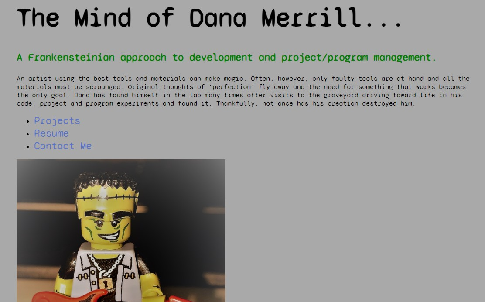

# Dana Merrill - Original Portfolio v.3

## Review and Summary of Work

This is the third iteration of a Portfolio that started in Week 2 of Boot Camp.

My goal for this version was to clean up some of the representation of information (stacked project cards are all equally reactive and functional down to mobile-size and there are five projects represented).

There is one more iteration coming within this week that will update the architecture from .html into React which is the reason I did not pursue a more significant deployment (updating to JavaScript and releasing on Heroku with Mongo database support, for instance) but stayed with expanding my original structure.

Deployed Page:  https://dtmerrill.github.io/HW2-DTM-Portfolio/

GitHub Repo:  https://github.com/dtmerrill/HW2-DTM-Portfolio

Contact Me:  dtmerrilliii@gmail.com
